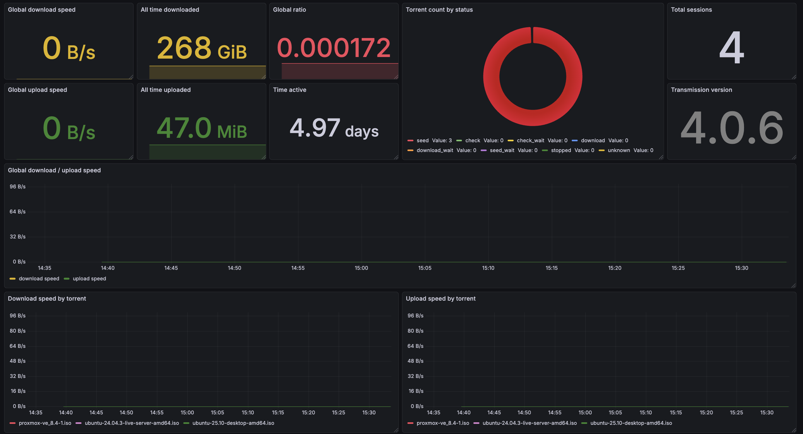

# Transmission Exporter


A Prometheus exporter for the [Transmission](https://transmissionbt.com/) bittorrent client, written in Go. This exporter collects metrics from Transmission's RPC API and exposes them in Prometheus format for monitoring and alerting.

## Metrics

### Global Metrics

The exporter always collects the following global metrics:

| Metric Name | Type | Labels | Description |
|------------|------|--------|-------------|
| `transmission_downloaded_bytes_total` | Counter | - | Total number of bytes downloaded since Transmission daemon started |
| `transmission_uploaded_bytes_total` | Counter | - | Total number of bytes uploaded since Transmission daemon started |
| `transmission_torrents_added_total` | Counter | - | Total number of torrents added since Transmission daemon started |
| `transmission_seconds_active_total` | Counter | - | Total number of seconds the Transmission daemon has been active since it started |
| `transmission_sessions_total` | Counter | - | Total number of sessions since Transmission daemon started |
| `transmission_upload_bytes_per_second` | Gauge | - | Current aggregated upload speed across all torrents in bytes per second |
| `transmission_download_bytes_per_second` | Gauge | - | Current aggregated download speed across all torrents in bytes per second |
| `transmission_torrents` | Gauge | `status` | Number of torrents grouped by status (e.g., "downloading", "seeding", "stopped") |

### Torrent-Level Metrics (Optional)

When enabled via `EXPORT_TORRENT_LEVEL_METRICS=true`, the exporter also collects per-torrent metrics labeled by torrent hash:

| Metric Name | Type | Labels | Description |
|------------|------|--------|-------------|
| `transmission_torrent_download_bytes_per_second` | Gauge | `hash` | Current download speed for this torrent in bytes per second |
| `transmission_torrent_upload_bytes_per_second` | Gauge | `hash` | Current upload speed for this torrent in bytes per second |
| `transmission_torrent_total_size_bytes` | Gauge | `hash` | Total size of the torrent in bytes |
| `transmission_torrent_size_when_done_bytes` | Gauge | `hash` | Size of the torrent when download completes in bytes. May differ from total size if some files are not selected for download |
| `transmission_torrent_left_until_done_bytes` | Gauge | `hash` | Number of bytes remaining until the torrent download is complete. Only counts wanted data |
| `transmission_torrent_downloaded_bytes_total` | Counter | `hash` | Total number of bytes downloaded for this torrent since it was added |
| `transmission_torrent_uploaded_bytes_total` | Counter | `hash` | Total number of bytes uploaded for this torrent since it was added |
| `transmission_torrent_corrupt_bytes_total` | Counter | `hash` | Total number of corrupt bytes recorded for this torrent since it was added |
| `transmission_torrent_peers_connected` | Gauge | `hash` | Current number of peers connected for this torrent |
| `transmission_torrent_peers_sending_to_us` | Gauge | `hash` | Current number of connected peers sending data to us for this torrent |
| `transmission_torrent_peers_getting_from_us` | Gauge | `hash` | Current number of connected peers receiving data from us for this torrent |
| `transmission_torrent_webseeds_sending_to_us` | Gauge | `hash` | Current number of webseeds sending data to us for this torrent |
| `transmission_torrent_seconds_downloading_total` | Counter | `hash` | Total number of seconds this torrent has spent downloading since it was added |
| `transmission_torrent_seconds_seeding_total` | Counter | `hash` | Total number of seconds this torrent has spent seeding since it was added |
| `transmission_torrent_info` | Gauge | `hash`, `name` | Static information about a Transmission torrent. Always has value 1. Use this metric to join with other torrent-level metrics using the torrent hash and name labels |

## Quick Start

### Environment Variables

| Environment Variable | Required/Optional | Description                                                          |
|---------------------|------------------|----------------------------------------------------------------------|
| `TRANSMISSION_HOST` | Required | Transmission RPC host (e.g., `http://localhost:9091`)                |
| `TRANSMISSION_USER` | Required | Transmission RPC username                                            |
| `TRANSMISSION_PASSWORD` | Required | Transmission RPC password                                            |
| `PORT` | Required | Port for the metrics HTTP server (e.g. `2112`)                       |
| `EXPORT_TORRENT_LEVEL_METRICS` | Optional | Set to `true` to enable per-torrent metrics (default: `false`)       |
| `LOG_LEVEL` | Optional | Logging level: `debug`, `info`, `warn`, or `error` (default: `info`) |

### Running with Docker (recommended)

Production-ready Docker images are pushed to a Dockerhub [repository](https://hub.docker.com/repository/docker/jdumbell92/transmission-exporter/general) for convenience.

```bash
docker run \
  --name transmission-exporter \
  -p 2112:2112 \
  -e TRANSMISSION_HOST=http://transmission:9091 \
  -e TRANSMISSION_USER=admin \
  -e TRANSMISSION_PASSWORD=password \
  -e PORT=2112 \
  -e EXPORT_TORRENT_LEVEL_METRICS=true \
  jdumbell92/transmission-exporter:latest
```

### Running from Source

1. Clone the repository:

```bash
git clone https://github.com/j-dumbell/go-qbittorrent.git
cd go-qbittorrent
```

2. Build the exporter:

```bash
go build -o transmission-exporter ./cmd/exporter
```

3. Run the exporter:

```bash
export TRANSMISSION_HOST=http://localhost:9091
export TRANSMISSION_USER=admin
export TRANSMISSION_PASSWORD=password
export PORT=2112
export EXPORT_TORRENT_LEVEL_METRICS=true

./transmission-exporter
```

## Grafana dashboard

A Grafana dashboard built from the Prometheus metrics from this exporter can be found [here](grafana/dashboards/transmission-exporter.json).



## Development

### Start local services (Transmission, Prometheus, Grafana)

```bash
docker compose up -d
```

### Start exporter

```bash
make start-exporter
```

### Tests

```bash
make test
```

## Contributing

Contributions are welcome! Please feel free to submit a Pull Request.

### How to Contribute

1. Fork the repository
2. Create a feature branch (`git checkout -b feature/amazing-feature`)
3. Commit your changes (`git commit -m 'Add some amazing feature'`)
4. Push to the branch (`git push origin feature/amazing-feature`)
5. Open a Pull Request

## License

See [LICENSE](LICENSE) file for details.

